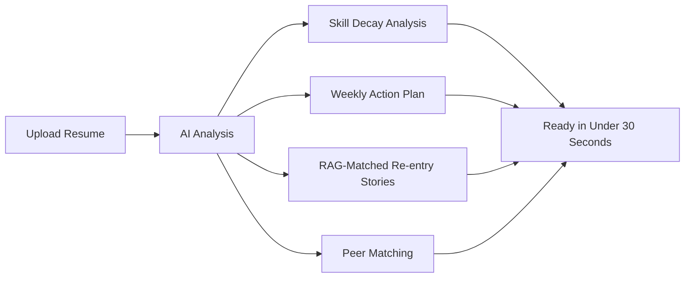
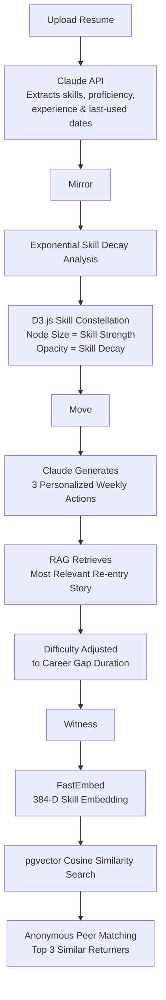

# Return Ready 

> *Your career didn't pause. It took a different path.*

AI-powered workforce re-entry platform for women. 

**P.S. This project won first place at Hackfinity,2026 :)**  
**[Video Demo](https://drive.google.com/file/d/1mFyYjCvtBahEjVKPVr5R0nscKxHRZ3Fg/view?usp=sharing)**

**[Sample Resume for Testing](https://drive.google.com/file/d/1l5eFjdf34IKI-sTucVblIQHD2sqoPIxJ/view?usp=sharing)**

---

## How It Works



---

## Tech Stack

**Backend:** FastAPI, Claude API, fastembed, Supabase + pgvector, pdfplumber  
**Frontend:** React + Vite, Tailwind, D3.js

---

## The Science

Skill decay: `score = base × e^(-λ × months_unused)`

Decay rates grounded in WEF Future of Jobs 2023 (tech λ=0.03, half-life 23 months) and Becker 1964 (leadership λ=0.008, half-life 87 months). Thresholds derived from Dreyfus Skill Acquisition Model and adjusted using McKinsey Women in the Workplace 2023 (women underestimate skills by 15-20% after long gaps).

---

## Setup

```bash
# Backend
cd returnready-ml
python -m venv venv && venv\Scripts\activate
pip install fastapi uvicorn supabase python-dotenv anthropic fastembed pdfplumber
venv\Scripts\python.exe seed_stories.py
venv\Scripts\python.exe seed_users.py
venv\Scripts\python.exe -m uvicorn main:app --reload

# Frontend
cd returnready-frontend
npm install && npm run dev
```

`.env` (backend): `SUPABASE_URL`, `SUPABASE_KEY`, `ANTHROPIC_API_KEY`  
`.env` (frontend): `VITE_API_URL=http://localhost:8000`

---

## Known Limitations

- Supabase free tier pauses after 7 days of inactivity
- Decay rates are research-informed heuristics, not empirically calibrated
- Peer matching requires seeded users — sparse on a fresh database
- RAG corpus is 15 stories which is sufficient for demo, not production
- Target role is free text leading to inconsistent phrasing affects gap analysis

---

## References

Dreyfus & Dreyfus (1980) · Becker (1964) · WEF Future of Jobs (2023) · McKinsey Women in the Workplace (2023) · Ebbinghaus (1885)
